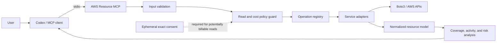

# AWS Resource MCP

[](https://github.com/herrerogusano/aws-resource-mcp/actions/workflows/ci.yml)

A local, read-only Model Context Protocol server that turns natural-language
questions into bounded AWS inventory, activity, coverage, Free Tier, and cost
risk analysis. It is written in Python, runs over `stdio`, and is designed for
use with Codex or another compatible MCP client.

The project favors honest partial results over false certainty: missing
permissions, incomplete regional coverage, timeouts, and unavailable signals
remain explicit in every response.

## What it does

| MCP tool | Purpose |
| --- | --- |
| `health_check` | Validate local configuration and optional AWS identity access |
| `listar_recursos_aws` | Build a normalized, deduplicated resource inventory |
| `analizar_actividad_recursos` | Classify the best-known activity signal without equating configuration changes with usage |
| `diagnosticar_cobertura_aws` | Explain which services, regions, permissions, and data sources are actually available |
| `analizar_riesgo_costes` | Prioritize resources using explainable indicators without claiming actual spend |
| `revisar_free_tier` | Read account plan and Free Tier usage through registered operations |
| `consultar_costes_aws` | Prepare and, only after exact consent, execute one bounded Cost Explorer request |

## Architecture



AWS credentials and profiles remain outside the repository. The server uses
Boto3's standard credential chain and never creates, modifies, or deletes AWS
resources.

## Safety model

- Read-only operations only; writes and unknown operations fail closed.
- `free-only` is the default economic policy.
- Potentially billable reads require short-lived consent for an exact operation
  and payload; a boolean parameter alone cannot grant it.
- Time, page, request, result, and regional budgets are enforced before SDK
  calls.
- Account identifiers, ARNs, tags, and provider errors are sanitized according
  to the tool contract.
- Empty output never means “the account is empty” unless the requested scope was
  actually queried completely.
- CI uses no AWS credentials and makes no live AWS request.

## Example interaction

```text
User: Which resources in eu-west-1 could generate costs?

Codex calls:
  listar_recursos_aws(region="eu-west-1", include_cost_indicators=true)
  analizar_riesgo_costes(regions=["eu-west-1"])

Result:
  status: complete_for_requested_scope
  risk: medium
  evidence: configuration-based indicators only
  actual spend queried: no
  next step: review the named resource types or explicitly request a bounded
             Cost Explorer query
```

The example is synthetic and contains no account data. See the
[safe demo](docs/demo.md) for a repeatable walkthrough.

## Quick start

Requirements: Python 3.12+ and [uv](https://docs.astral.sh/uv/).

```powershell
uv sync --locked --all-groups
uv run aws-resource-mcp
```

The repository includes an optional Codex MCP configuration in
`.codex/config.toml`. Configure the AWS profile outside the repository, then ask
questions such as:

- “What resources do I have in `eu-west-1`?”
- “Which resources have no known recent activity?”
- “What parts of the account could not be inspected?”
- “Which resources have cost indicators without querying actual spend?”

When a response is `partial_pending_consent`, the client should explain the
exact pending operations and wait for the user. See the
[Codex integration guide](docs/codex-integration.md).

## Quality gates

```powershell
uv run ruff format --check src tests
uv run ruff check src tests
uv run python -m compileall -q src
uv run aws-resource-mcp-generate-iam --check
uv run pytest -q
```

The IAM generator derives deterministic policy artifacts from the same central
operation registry used at runtime. Generated artifacts are checked in CI so
the documented permissions cannot silently drift from reachable operations.

## Coverage and limitations

- Resource Explorer provides broad discovery but is not universal or strongly
  consistent.
- Service adapters cover Lambda, S3, EC2/EBS/VPC, RDS/Aurora, DynamoDB,
  ECS/Fargate, API Gateway, CloudFormation, SQS, SNS, IAM, CloudFront, and Route
  53 with service-specific limits.
- CloudTrail management history is bounded to its available lookback and is not
  equivalent to functional application usage.
- CloudWatch metric reads remain blocked under the default cost policy.
- Cost Explorer forecasting and resource-level cost queries are intentionally
  not implemented.
- This is a local analysis tool, not a hosted multi-user service or an automated
  remediation system.

## Documentation

- [Architecture](docs/architecture.md)
- [Safe demo](docs/demo.md)
- [Service adapters](docs/service-adapters.md)
- [Coverage diagnostics](docs/diagnostics-and-coverage.md)
- [Activity analysis](docs/activity-analysis.md)
- [Economic analysis and consent](docs/economic-analysis.md)
- [Least-privilege IAM](docs/iam-least-privilege.md)
- [Zero-cost policy](docs/zero-cost-policy.md)
- [Design decisions](docs/decisions.md)
